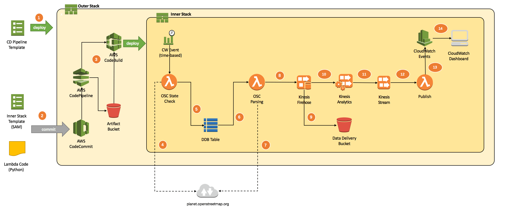
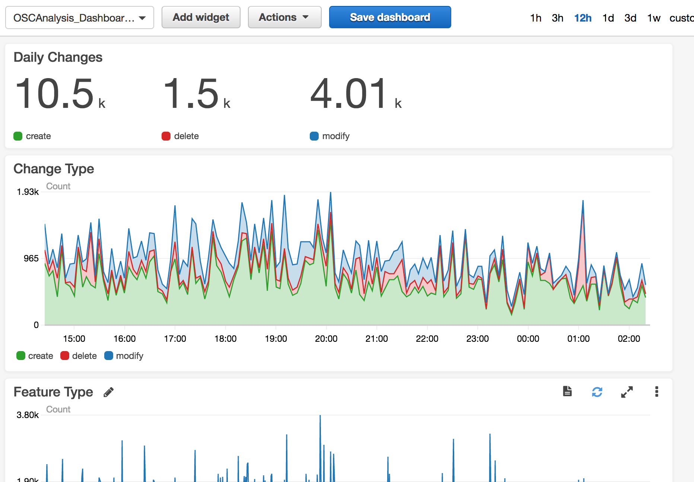
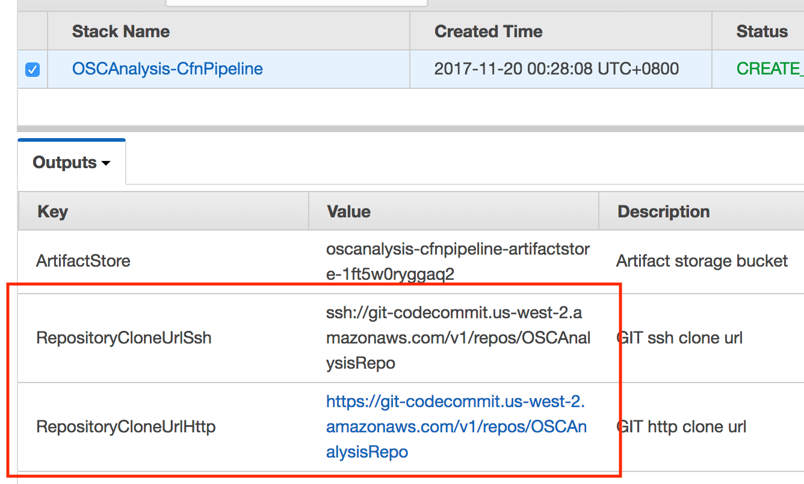
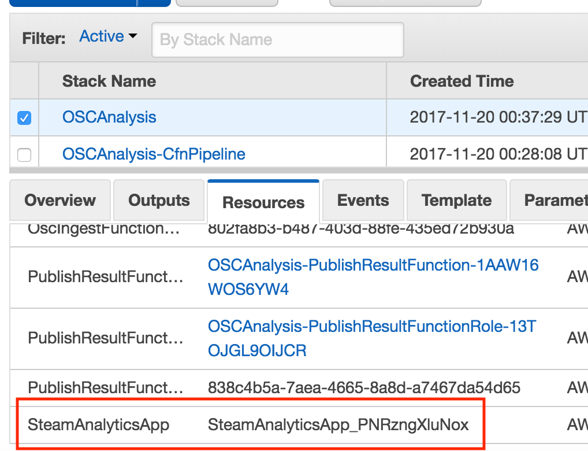
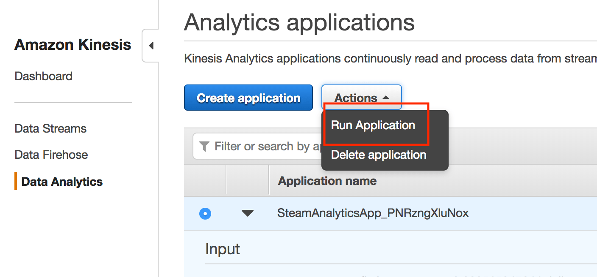

# OSM Change Stream Analysis

[Open street map](http://www.openstreetmap.org/) is open data project which
map data is contributed by users all over the world.

It provides a replication data stream where all user changes are aggregated
and published periodically. (See [this OSM wiki](http://wiki.openstreetmap.org/wiki/Planet.osm/diffs) 
for data url and format specfication).

This project demostrates how to do simple stream analysis on OSC stream using 
AWS services like Lambda, Kinesis Analytics, and manage resources using 
CodePipeline and [Serverless Application Model](https://github.com/awslabs/serverless-application-model).

# Design

1. Deploy CloudFormation CD template.
2. Commit SAM enabled template and Lambda code to CodeCommit repository.
3. CodePipeline packages the template and resources and upload them to artifact bucket, then automaticlly deploys the inner stack.
4. Check OSC state from planet osm site.
5. Write state and download URL to DynamoDB table.
6. DynamoDB steaming triggers OSC parsing lambda function.
7. Parser downloads OSC file, parse OSC XML on-the-fly.
8. Write result to Firehose as JSON records.
9. Firehose write aggrated and compressed records to S3.
10. Firehose streaming records to Kinesis Analytics.
11. Kinesis Analytics publish steaming analytics results to Kinesis Stream.
12. Kinesis stream triggers lambda function to publish analytics results.
13. Analytics results are written to CloudWatch as custom metrics.
14. CloudWatch Dashboard collects and display metrics.

Here's the dashboard showing changes of last day:

# Quickstart

## Bootstrap
CloudFormation continous delivery is used to build and package SAM temlate and Lambda code.

This technic is described in [AWS Lambda docucment](http://docs.aws.amazon.com/lambda/latest/dg/deploying-lambda-apps.html), [CloudFormation document](http://docs.aws.amazon.com/AWSCloudFormation/latest/UserGuide/continuous-delivery-codepipeline.html), AWS also has a sample solution [here](https://github.com/awslabs/codepipeline-nested-cfn).

The bootstrap template is `solutions/CfnCD/SimpleCfnCd.template.yaml`, we use `awscfncli` to deploy template, but you can also use official `awscli` or just AWS console.

> The "inner stack" uses Kinesis Analytics which is only available in certain regions at the time of writing.

Parameter                  | Value         
-------------------------- | -------------
CloudFormation Stack Name  | Set this to desired "inner stack", eg: `OSCAnalysis`
CloudFormation Execution Role ARN | Leave this blank.
Main CloudFormation Template | Set this to `solutions/OSCAnalysis/OscAnalysis.template.yaml`
Staging Stack Config | `staging.json`
Production Stack Config | `production.json`
CodeCommit Repository Name | Set this to desired git repository name, eg: `OSCAnalysisRepo`
Approval Emails | Set this to your email address.
Number of Emails | `1`
KMS Key | Set this to KMS S3 default key ID.  (If you can't find `aws/s3` key, upload a random object to any S3 bucket first).

## Trigger CD Pipeline 

After the CD stack is deployed, confirm SNS suscription approval email, pull this repository and push it to the CodeCommit repository:

> The repository is located in the same region of bootstap template, for instructions on how to work with CodeCommit, check  [CodeCommit user guide](http://docs.aws.amazon.com/codecommit/latest/userguide/setting-up.html).

An email will be sent asking for approval:

	Hello,
	
	The following Approval action is waiting for your response:
	
	--Pipeline Details--
	
	Pipeline name: <pipeline name>
	Stage name: Production
	Action name: Approval
	Region: <region>
	
	--Approval Details--
	
	Approve or reject: <approve url>
	Additional information: Please approve change set <changeset name>
	Deadline: This review request will expire on <time>
	
	Sincerely,
	Amazon Web Services

Click the approval url brings up CodePipeline console, and approval dialog box, type a message and approve the changeset, then the inner stack will be created automatically.

## Start Streaming Analytics

Currently there is no way to start Kinesis Analytics application in CloudFormation so this has to be done manually.

Wait until inner stack state become `CREATE_COMPLETE`, locate the Kinesis Analytics application in Stack Resources tab:

Then locate and select the application in Kinesis Analytics console, click "Actions" then "Run Application":

